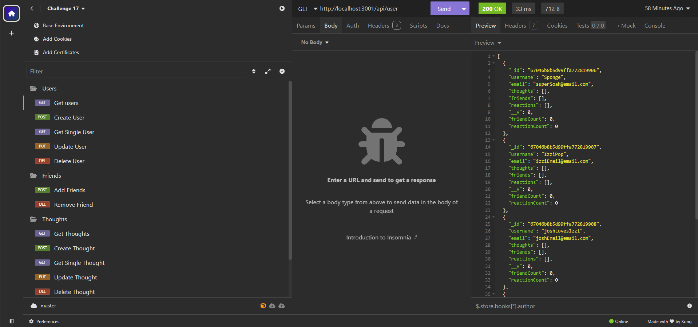
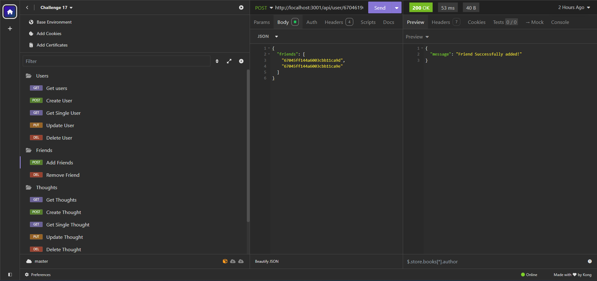
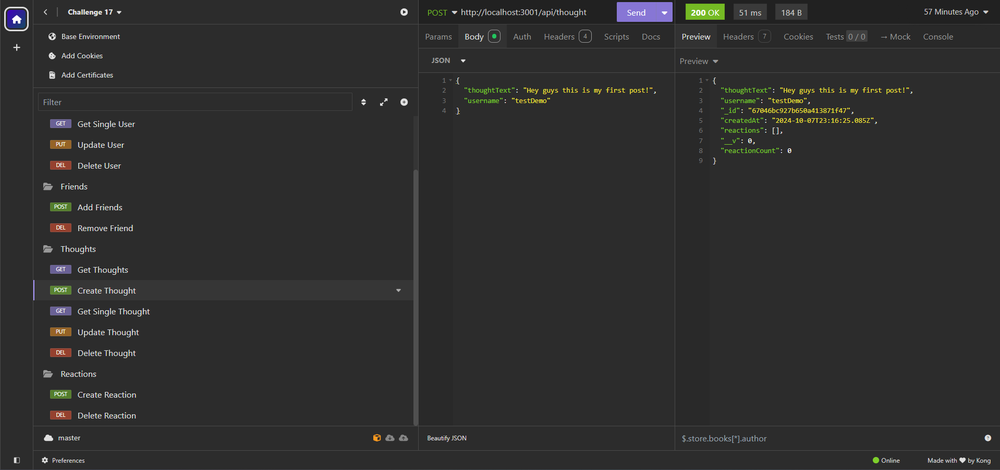
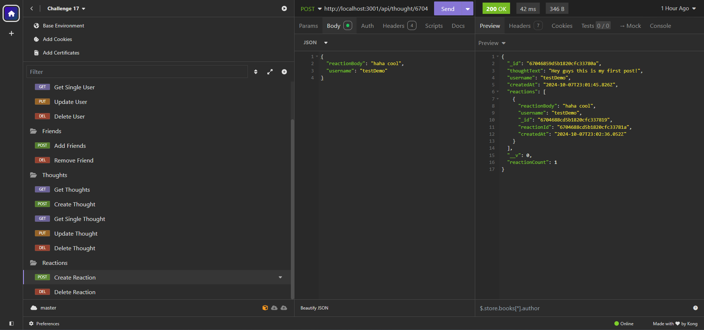

# Challenge-17 (MongoDB Social Media)

## Introduction

[](https://opensource.org/licenses/MIT)
[](https://github.com/ellerbrock/typescript-badges/)

This app runs off the mongoDB database. It acts as a kind of social media that you interact with using routes.

Click <a href="https://drive.google.com/file/d/1hZ0U-JHFA99XTYIQLSRVgRjG6y3w5VWa/view?usp=sharing">here</a> to take you to a demonstration video of how to use the routes!

## Table of Contents

- [Required-Technologies](#required-technologies)
- [Installation](#installation)
- [Usage](#usage)
- [Code Snippet](#code-snippet)
- [Screenshots](#screenshots)
- [Features](#features)
- [Future-Features](#future-features)
- [License](#license)
- [Technologies](#technologies-used)
- [Credits](#credits)
- [Contact Me](#contact-me)

## Required Technologies

This project requires node.js and its included node package manager.\
You can go to <a href="https://nodejs.org/en/download/package-manager">this</a> website to download node.js and npm. Just follow node's included download instructions!

MongoDB is also required to use this Project. You can follow <a href="https://www.mongodb.com/">this</a> to go to mongoDB's main site. Just follow their instructions on how to install mongoDB onto your system.

You also will need an API debuging tool to interface with the database. My tool of choice is insomnia, which can be installed <a href="https://insomnia.rest/">here</a>. Follow their guide to install insomnia onto your system.

## Installation

Once the files are downloaded onto your machine open the project folder and run the terminal in the root directory.
To install the necessary dependencies run the "npm i" command to install the required files.

To start the application just use "npm run start" to run the server. A list of commands is provided in the "package.json" file for additional commands.

## Usage

Once the server has been started and insomnia is up and running you can start making requests to the server. Once the server is started you will be provided with a link you can use to interface with the server, it should look something like this "http://localhost:3001".

This is a list of the requests you can make to the server. The type of request is listed at the top. The route is listed below that. Below the route an explanation is provided if needed. And any json data needed is listed below that. Remember a valid url should look something like this "http://localhost:3001/api/users". Just switch out the route after the port to access different routes.

### Users

#### Get (Gets all users)

/api/users

<p>Will get all users.</p>

#### Post (Creates a new user)

/api/users

This is the json needed to create a user. Just fill it out with the username and email you wish you use. The email must be a valid email.

```
{
    "username": "demo",
    "email": "email@email.net"
}
```

#### Get (Get single user)

/api/user/{userId}

Just put in the id of the user after the user/. Will return the asked for user.

#### Put (Update user)

/api/user/{userId}

Just put in the id of the user after the user/. Fill out this json as needed to update the users information.

```
{
    "username": "demo",
    "email": "email@email.net"
}
```

#### Delete (Delete a user)

/api/user/{userId}

Just put in the id of the user after the user/. This will delete the selected user.

### Friends

#### Post (add friends)

api/users/{userId}/friends

Just put in the id of the user after the user/. Add /friends to the end to access the friends route. This is the json needed to add a friend. You can add one or as many friends as you want at a time. Just add the users id to the friends array. If you want to add just one friend only keep one id in the array. Adding more friends is as easy as just adding one more users id seperated by a comma.

```
{
    "friends": [
        "{friendId}",
        "{friendId2}"
    ]
}
```

#### Delete (delete a friend)

api/users/{userId}/friends/{friendsId}

Just put in the id of the user after the user/. Add your already added friends id after the friends/. You cannot un-add friends who have not been added as a friend.

### Thoughts

Thoughts act like the posts of this social media database.

#### Get (get thoughts)

/api/thoughts

Will get all created thoughts from the database.

#### Post (Create a thought)

/api/thought

This will create a new thought. Just fill out and attach the json below to create a new thought. The username you attach to the json will add the thought id to the user.

```
{
    "thoughtText": "Placeholder Placeholder Placeholder",
    "username": "demo"
}
```

#### Get (Get single thought)

/api/thought/{thoughtId}

This will retrieve a single thought based on the thought id you put in. You cannot use a user id to retrieve a thought. Using this route it has to be a thought id which is added to every created thought.

#### Put (Update thoght)

/api/thought/{thoughtId}

Using a thought id you can update a thoughts information. You can use the json below as a template to use as how to format your data. It is the same as the data used to create a thought.

```
{
    "thoughtText": "Placeholder Placeholder Placeholder",
    "username": "demo"
}
```

#### Delete (Delete a thought)

/api/thought/{thoughtId}

Using a thought id you can delete a created thoght.

### Reactions

Reactions essentially act like the comments in this social media database.

#### Post (Create Reaction)

/api/thought/{thoughtId}/reactions

To create a new reaction use the provided route. Use the thought id of the thought you wish to add a reaction to. Use the json below to interface with the server and create a new reaction. Provide a comment in the reactionBody and put the username of the user you wish to send this reaction through in username.

```
{
    "reactionBody": "Placehoder Placeholder Placeholder",
    "username": "demo"
}
```

#### Delete (Delete Reaction)

/api/thought/{thoughtId}/reactions/:reactionId

To delete a created reaction just use the route above. Provide a thought id to the post you put the reaction under. Then provide a reaction id after the reactions/ to delete the reaction you created.

## Code Snippet

This is the function used to add friends. To add a new friend we first update the user to have the newly added friends. This is as easy as finding the user by the provided id and then setting the friends field within user to have the newly added friend data within the provided json.

Now that the user has the friends added we now have to update the friends to have the user added as well. We use a for loop to iterate over the array within the json file. For each index we then set that indexed user to have the user id placed within the friends array. We then check to see that everything when setting the friends went okay. If it went okay we continue to the next index if there is one.

Once everything is over we tell the user that the friends have been successfully added and return.

```
export const addFriend = async(req: Request, res: Response) => {
    try {
        //update user
        const user = await User.findOneAndUpdate(
            {_id: req.params.userId},
            {$set: {friends: req.body.friends}},
            {runValidators: true, new: true},
        )

        if(!user){
            return res.status(404).json({message: 'No user with that id found!'});
        }

        // update added friend or friends
        for(let i=0; i < req.body.friends.length; i++){
            console.log(`Friend: ${req.body.friends[i]}`)
            const friend = await User.findOneAndUpdate(
                {_id: req.body.friends[i]},
                {$set: {friends: req.params.userId}},
                {runValidators: true, new: true},
            )

            if(!friend){
                return res.status(404).json({message: 'No user with that username exists!'});
            }
        }

        res.json({message: 'Friend Successfully added!'});
        return
    } catch(err: any){
        res.status(500).json(err);
        return;
    }
}

```

## Screenshots

#### This is us grabbing the user data using the get users route in insomnia.



#### This is us adding a new friend using the friend route.



#### This is us creating a new thought using the post thoughts route.



#### This is us creating a new reaction using the post reaction route.



## Features

Features include:

- View, Create, update, and delete users.
- View individual users.
- Add and remove friends on users.
- View, Create, update, and delete Thoughts.
- View individual Thoughts.
- Add and remove reactions to thoughts.

## Future Features

Features that may be implemented in the future include:

- A front end to make interfacing with the server more user friendly and easy to access.
- Sign in and local storage functionality.

## License

Licensed under the MIT license.

## Technologies Used

<ul>
<li>The mongoose docs <a href='https://mongoosejs.com/docs/'>here</a> (general mongoose help)</li>
<li>Stack Overflow (For specific mongoose issues and ideas)</li>
<li>Node.js (for installing packages as well as building and running code).</li>
<li>Visual Studio Code (for writing code).</li>
<li>Mozila Web Docs and W3 Schools (for getting help with TypeScript).</li>
</ul>

## Credits

<ul>
<li>Joshua Pruitt (me)</li>
<li>Coding bootcamp staff (for their help with Coding)</li>
</ul>

## Contact Me

<ul>
<li>My email: joshuapruitt6484@gmail.com</li>
<li><a href=https://github.com/JoshuaPruitt>My GitHub</a></li>
<li><a href=https://www.linkedin.com/in/joshua-pruitt-1a494a311>My LinkedIn</a></li>
</ul>
